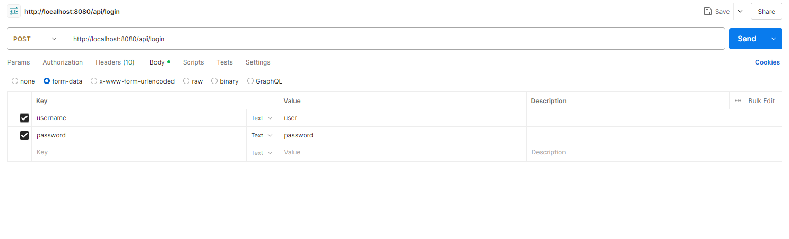

# Task Manager Backend With Spring
## Project Summary:
- Developed a RESTful API with Spring and Spring Boot to implement the backend of a task manager application, allowing users to perform CRUD operations on their tasks
- Utilized Gradle to automate the building of project dependencies
- Secured the endpoints using the Web Security package and applied CSRF token for authentication
- Encrypted passwords using BCrypt and stored data within a MongoDB instance
- Designed a layered architecture separating concerns with RestController, Service, and Repository layers, ensuring maintainability and scalability of the application
- Applied best practices in Spring Boot development, including dependency injection, use of annotations, and proper exception handling

## Endpoints:
### Adding a task

### Deleting a task

### Get all tasks

### Get task by id

### Login

### Updating a task

